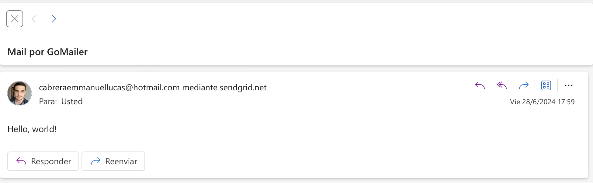

# GoMailer

GoMailer es una aplicación para enviar correos electrónicos utilizando Go (Golang).

## Descripción

Este repositorio contiene el código fuente de GoMailer, una aplicación diseñada para facilitar el envío de correos electrónicos a través de servicios de correo electrónico como SendGrid. Utiliza Go para el backend y está configurado con una arquitectura modular para mantener la escalabilidad y la facilidad de mantenimiento.

## Estructura del Proyecto

El proyecto está organizado de la siguiente manera:
```
goMailer/
│
├── cmd/                    # Punto de entrada de la aplicación
│   └── api/                # Código específico para la API HTTP
│
├── internal/               # Código interno de la aplicación
│   ├── domain/             # Definiciones de estructuras 
│   ├── repositories/       # Implementaciones de repositorios
│   └── services/           # Lógica de negocio y servicios
│
└── tests/                  # Pruebas unitarias y de integración
```

## Instalación

### Requisitos previos
- Go (instalación y configuración)
- Claves de API (ej. SendGrid API Key) para configurar y probar el envío de correos electrónicos.

### Pasos para la instalación
- Clona este repositorio:
- git clone https://github.com/LucasEmmanuelCabrera94/GoMailer.git

### Configura las variables de entorno:
Por terminal:
```
export SENDGRID_API_KEY="Aca va tu key de SendGrid"
```

### Compila y ejecuta la aplicación:
```
go run cmd/api/main.go
```
Accede a la API desde tu navegador o herramienta de desarrollo de API (por ejemplo, Postman):

URL: POST http://localhost:8080/messages

Body:
```
[
    {
    "from": "mailregistrado@hotmail.com", //aca tiene que ir el mail registrado en https://sendgrid.com/
    "to": "prueba@hotmail.com",
    "subject": "Mail por GoMailer",
    "body": "Hello, world!"
    }
]
```

Y te deberia llegar un mail con esta pinta: 



### Comandos de testeo:
Comando para pasar los test:
- go test -cover ./...     

Comandos para crear coverage y despues verlo:

- go test -coverprofile=coverage.out ./..
- go tool cover -html=coverage.out